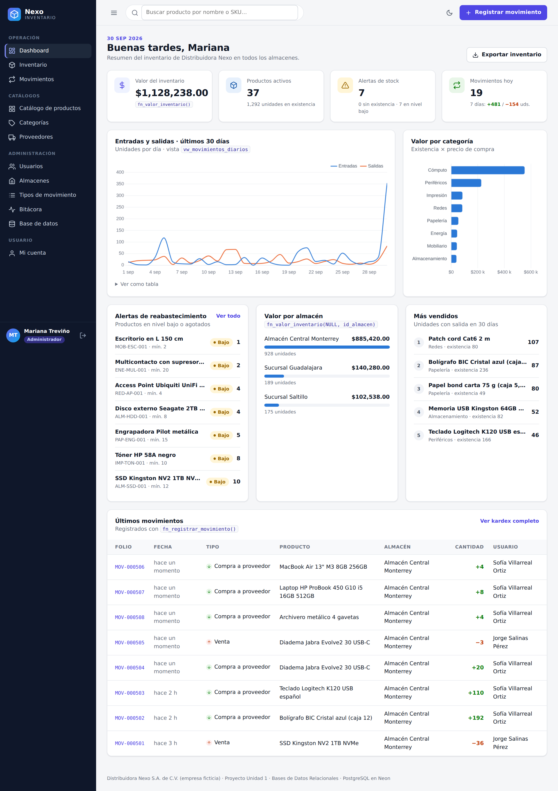
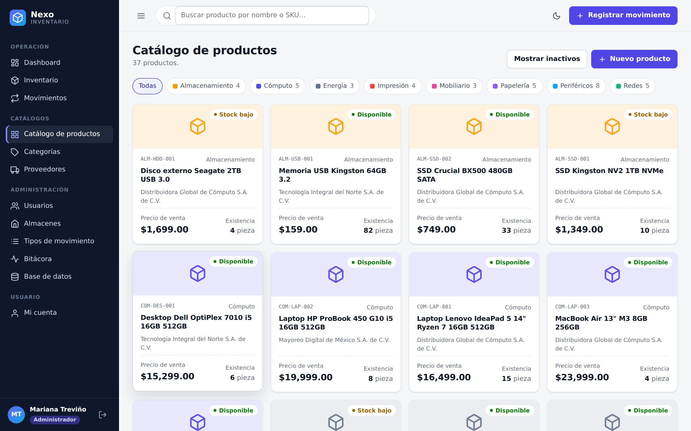
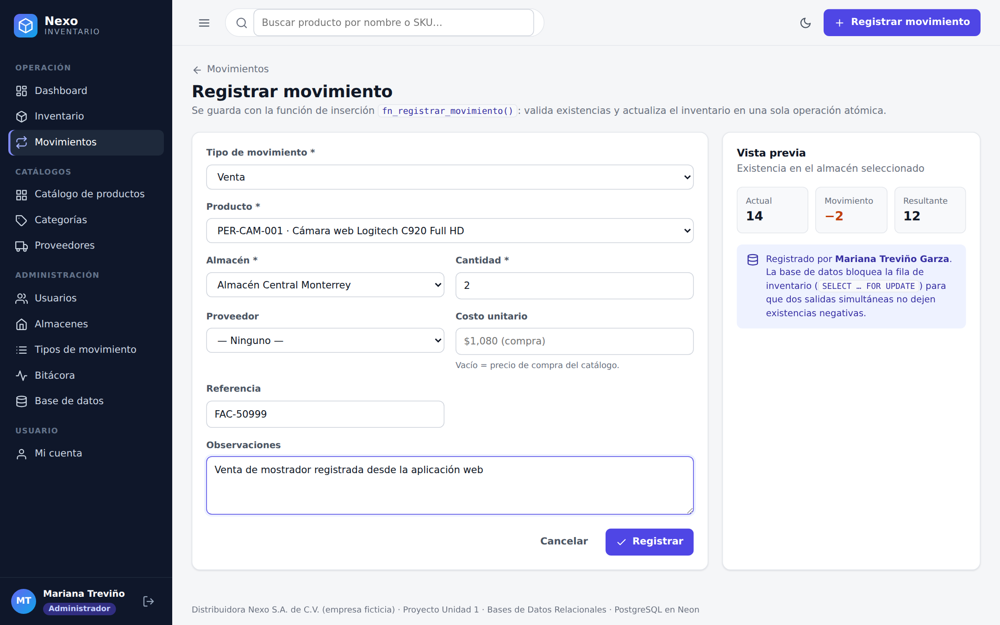
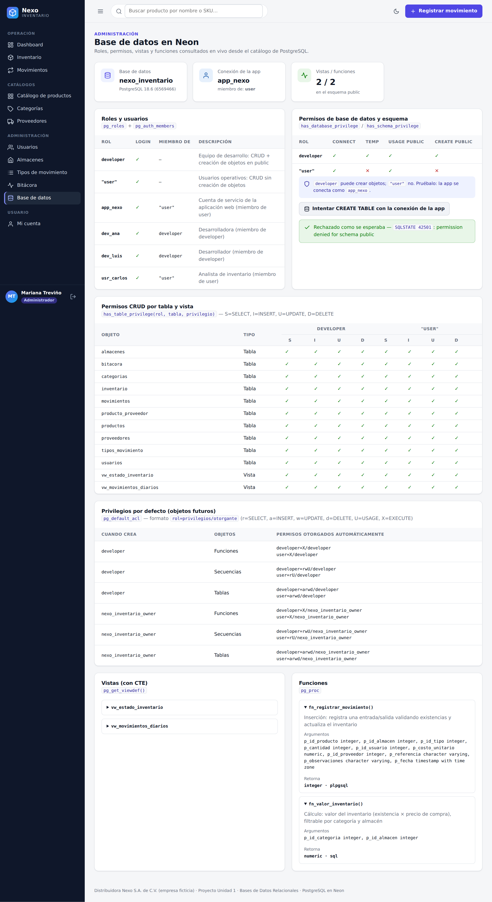
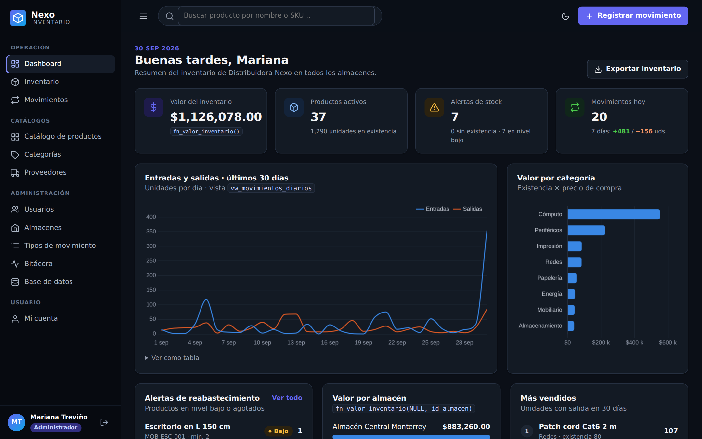
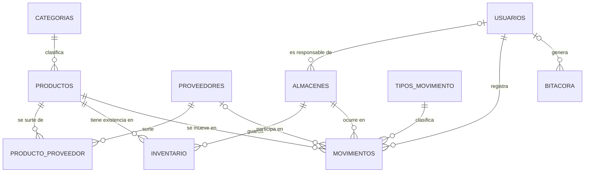

# Nexo Inventario · Base de datos en la nube (Neon + PostgreSQL)

Proyecto de la **Unidad 1 · Bases de Datos Relacionales**: implementación completa de una base de datos en
**Neon (PostgreSQL 18)** con roles y usuarios diferenciados, vistas con CTEs y funciones, explotada por un
sistema web de inventario para **Distribuidora Nexo S.A. de C.V.** (empresa ficticia).



📄 **Producto final (PDF):** [`docs/reporte/Reporte_Proyecto_U1.pdf`](docs/reporte/Reporte_Proyecto_U1.pdf) ·
🧪 **Evidencias en texto:** [`docs/evidencias/EVIDENCIAS.md`](docs/evidencias/EVIDENCIAS.md)

## Cumplimiento de la práctica

| # | Requisito | Dónde está |
|---|-----------|-----------|
| 1 | Crear la base de datos en Neon | Proyecto `nexo-inventario-u1`, BD `nexo_inventario` (PostgreSQL 18, AWS us-east-2) · Evidencia 1 |
| 2 | ≥ 5 tablas con relaciones 1:N / N:M, PK, FK y tipos adecuados | **10 tablas** en [`database/01_esquema.sql`](database/01_esquema.sql) · N:M: `producto_proveedor`, `inventario` · Evidencia 2 |
| 3 | Rol `developer` (login, conexión, CREATE en public, CRUD actual y futuro) y rol `user` (login, CRUD actual y futuro, **sin** crear objetos) | [`database/02_roles_usuarios.sql`](database/02_roles_usuarios.sql) · Evidencia 3 |
| 4 | Crear usuarios y asignar roles | `dev_ana`, `dev_luis` → `developer`; `app_nexo`, `usr_carlos` → `"user"` · Evidencia 4 |
| 5 | Dos vistas con CTEs | `vw_estado_inventario`, `vw_movimientos_diarios` en [`database/03_vistas.sql`](database/03_vistas.sql) · Evidencia 5 |
| 6 | Dos funciones (cálculo e inserción) | `fn_valor_inventario`, `fn_registrar_movimiento` en [`database/04_funciones.sql`](database/04_funciones.sql) · Evidencia 6 |
| 7 | Usar las vistas y funciones | [`database/06_evidencias.sql`](database/06_evidencias.sql) y la aplicación web · Evidencia 7 |
| 8 | Producto final (PDF) | [`docs/reporte/Reporte_Proyecto_U1.pdf`](docs/reporte/Reporte_Proyecto_U1.pdf) |

## El sistema web

| Sección | Qué hace | Objetos de BD |
|---|---|---|
| **Dashboard** | KPIs, entradas vs. salidas (30 días), valor por categoría y almacén, alertas, más vendidos | `fn_valor_inventario`, `vw_estado_inventario`, `vw_movimientos_diarios` |
| **Inventario** | Existencias consolidadas o por almacén, semáforo, cobertura, exportación CSV | `vw_estado_inventario`, `inventario` |
| **Catálogo** | Tarjetas de productos, detalle con existencias por almacén, proveedores y kardex; alta/edición (admin) | `productos`, `producto_proveedor` |
| **Categorías / Proveedores** | Consulta para todos, CRUD para admin (la FK impide borrar categorías con productos) | `categorias`, `proveedores` |
| **Movimientos** | Kardex con filtros y registro de entradas/salidas con vista previa de existencia | `fn_registrar_movimiento` |
| **Administración** (admin) | Usuarios, almacenes, tipos de movimiento, bitácora y página *Base de datos* con roles/permisos en vivo | catálogo de PostgreSQL |
| **Mi cuenta** (usuario) | Perfil, cambio de contraseña, mis movimientos y mi actividad | `usuarios`, `movimientos`, `bitacora` |

La app se conecta con **`app_nexo`** (rol `"user"`): puede leer y escribir datos, pero PostgreSQL le niega crear
objetos. Encima de eso tiene su propio rol de aplicación (**admin** / **usuario**) con sesión y contraseñas bcrypt.

Cuentas de demostración: `admin@nexo.mx` / `Admin2026!` (admin) y `jorge.salinas@nexo.mx` / `Nexo2026!` (usuario).

<table><tr>
<td></td>
<td></td>
</tr><tr>
<td></td>
<td></td>
</tr></table>

## Instalación

Requisitos: **Node.js 18+** y una cuenta de **Neon**. No hace falta abrir el puerto 5432: la app usa el
driver HTTPS oficial de Neon.

```bash
git clone https://github.com/Vizpok/Sistema_Inventario_Proyecto.git
cd Sistema_Inventario_Proyecto
npm install
cp .env.example .env        # en Windows: copy .env.example .env
```

Llena `.env`:

- `DATABASE_URL_OWNER`: cadena de conexión del propietario (Neon → *Connect*).
- `PWD_DEV_ANA`, `PWD_DEV_LUIS`, `PWD_APP_NEXO`, `PWD_USR_CARLOS`: contraseñas para los usuarios de BD.
- `DATABASE_URL`: la misma cadena pero con el usuario `app_nexo` y su contraseña.

### Crear la base de datos (sólo si partes de una BD vacía)

```bash
npm run sql -- database/01_esquema.sql database/02_roles_usuarios.sql database/03_vistas.sql database/04_funciones.sql database/05_datos_prueba.sql
```

También puedes pegar cada script en el **SQL Editor de Neon** (en `02_roles_usuarios.sql` reemplaza los
marcadores `{{PWD_...}}` por contraseñas reales).

### Ejecutar

```bash
npm start            # http://localhost:3000
```

## Scripts

| Comando | Descripción |
|---|---|
| `npm start` / `npm run dev` | Inicia la aplicación (dev = recarga al guardar) |
| `npm run sql -- archivo.sql …` | Ejecuta scripts SQL en Neon (cada archivo en una transacción) |
| `npm run db:datos` | Regenera `database/05_datos_prueba.sql` (datos ficticios, ~500 movimientos vía la función) |
| `npm run evidencias` | Ejecuta `06_evidencias.sql` iniciando sesión con cada usuario y guarda `docs/evidencias/` |
| `npm run reporte` | Genera `docs/reporte/Reporte_Proyecto_U1.html` y `.pdf` (usa Edge/Chrome instalado) |

Para reiniciar los datos: `npm run sql -- database/00_reiniciar_datos.sql database/05_datos_prueba.sql`.

Los datos de la portada del PDF (alumno, matrícula, docente…) se editan en
[`docs/reporte/datos.json`](docs/reporte/datos.json); después ejecuta `npm run reporte`.

## Modelo de datos



Diagrama completo con atributos: [`docs/diagrama_er.svg`](docs/diagrama_er.svg) (fuente: [`docs/diagrama_er.mmd`](docs/diagrama_er.mmd)).

## Estructura

```
database/            Scripts SQL (00 reinicio · 01 esquema · 02 roles · 03 vistas · 04 funciones · 05 datos · 06 evidencias)
docs/                Reporte PDF, evidencias, capturas y diagrama ER
public/              CSS, JS del navegador y logo
scripts/             Ejecutor SQL, generador de datos, evidencias y reporte
src/                 Aplicación Express (rutas, vistas EJS, acceso a datos)
```

> `.env` nunca se sube al repositorio: contiene las contraseñas de la base de datos.
